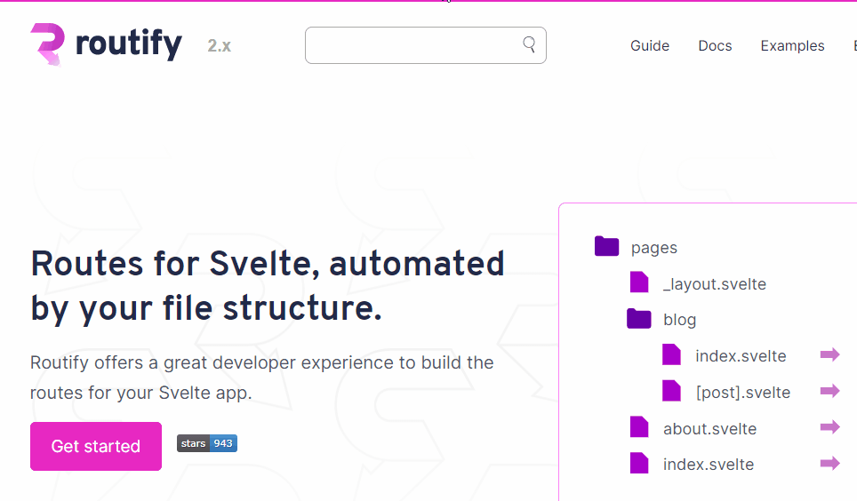

<div align="center">
  
  
  **Search engine for your static site.**

   Powered by [FlexSearch](https://github.com/nextapps-de/flexsearch)

   <br />
   <br />
</div>


Poindexter scans a folder for HTML files and indexes each file's content by its relative filename. The full index is output to `poindexter.bundle.js`, which can be imported and searched with poindexter or flexsearch.

# Getting started

### Requirements

To ensure that poindexter doesn't fail, please make sure that you added a 
```html
<meta name="keywords" content="Here,you,can,choose,the,keywords,that,are,fitting,to,your,site" />
```
tag to your html file(s), with libarys like [routify](https://routify.dev) it's enough when you add this metatag to your `__app.html` html entry file, where the JS gets ejected.

### Create a searchable index

```
npx poindexter [HTML folder] -o [output path]
```

### Searching with Poindexter

```javascript
  import { client } from "poindexter/runtime";  

  // loads the poindexter.bundle.json.
  // for custom path: `client.init({ path: '/path/to/poindexter.bundle.js' })`
  client.init()

  // search the index.
  client.index.search(query)
```

### Narrowing the indexable area
To avoid indexing navbars and widgets, Poindexter provide the following options.

**contentSelectors** An array of selectors. Poindexter tries each selector untill a match is found. Only the content of the first match is indexed. If no match is found, the page is skipped.

**IgnoreSelectors** An array of selectors. Poindexter removes any elements matching these selectors.

Please refer to the [scrape function](https://github.com/roxiness/poindexter/blob/master/defaults.js#L19) for more info. Alternatively you can use your own scrape function.

### Options
Please refer to the [defaults](https://github.com/roxiness/poindexter/blob/master/defaults.js) for now.

### Configuration
Thanks to [Configent](https://github.com/roxiness/configent) Poindexter can be configured here 
- poindexter.config.js
- package.json (create a poindexter field)
- environment
- .env
- command line
- API

### Title, description and keywords
Poindexter assumes that title, meta description and meta keywords are available in your HTML. Please refer to [defaults](https://github.com/roxiness/poindexter/blob/master/defaults.js#L16) If this is not the case, you can create your own resolvers.

Custom resolvers
```javascript
{
  title: $ => 'my website',
  description: $ => $('.description') || 'no description',
  keywords: $ => $('meta[name=keywords]').attr('content').split(',')
}
```

# FAQ

#### Can I use Poindexter with a SPA?
Poindexter requires a static site. If you have a SPA, have a look at [Spank](https://github.com/roxiness/spank).

#### Where can I use Poindexter?
Poindexter can be served from the client, your own backend or a serverless function.

#### How big are the index bundles?
A site like [routify.dev](https://routify.dev) with 65 pages, generates a 65 kb bundle after brotli compression.

---

# Example

[Routify dev build](https://routify-2020-git-searchify.sveltaforce.now.sh/)

